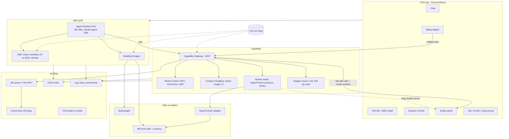
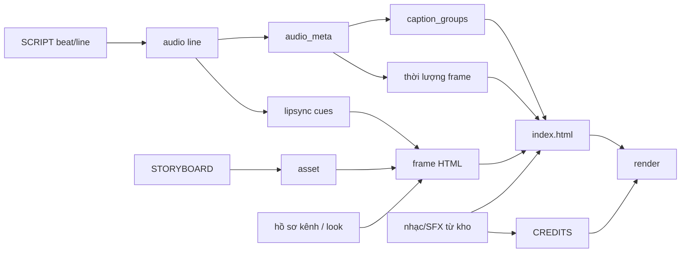

# StudioFlow Agent — Tài liệu thiết kế kiến trúc

**Phiên bản:** 3.0 · **Ngày:** 03/10/2026 · **Tác giả:** Tan

Bản hợp nhất cuối cùng sau các vòng thảo luận (v0.1–v2.7): chỉ ghi kết quả đã chốt. Mức chi tiết vừa phải; schema, tham số tool, UI và tiêu chí nghiệm thu nằm trong PRD/spec (mục 18). Thông tin đã xác minh từ công cụ ngoài ở Phụ lục A–B.

---

## 1. Mục tiêu và phạm vi

**Sản phẩm.** Ứng dụng desktop (dùng cá nhân) có agent chat kiểu Claude Code Desktop để sản xuất video YouTube cho nhiều kênh: kịch bản, giọng đọc, hình ảnh, dựng cảnh động, phụ đề, màu, overlay, render. Mỗi kênh là một project folder. Người dùng sửa qua **chat** hoặc **chỉnh trực quan** (HyperFrames Studio, bảng caption của app); **không sửa trực tiếp file nguồn**.

- **Phạm vi đích** (đạt dần qua M1–M5b): workflow thuyết minh, tài liệu, sách nói, Shorts, phim ngắn nhiều nhân vật; caption động, look màu, hiệu ứng, overlay; lip-sync mức 1 (comic/2D phẳng); thư viện asset theo kênh.
- **MVP = hết M2** (M1 là bản nội bộ): `narrated-explainer` + `story-documentary`, giọng OmniVoice, caption, kho nhạc local, ảnh sinh qua ComfyUI, sửa qua chat, Studio xem trước.
- **Ngoài phạm vi:** quản lý/kiểm tra giấy phép (model, nhạc, asset — người dùng tự xử lý ngoài app); sinh video bằng AI; lip-sync theo âm vị/AI; đăng YouTube tự động; đa người dùng; chạy app/đồng bộ trên cloud; phát hành cho người khác; HDR; tracking/mask. Gọi API cloud (LLM, ảnh tùy chọn) vẫn trong phạm vi, qua adapter.

**Mục tiêu kiến trúc: giảm chi phí phát triển về sau.**

| Thay đổi | Chỉ cần |
|---|---|
| Thể loại video mới | Gói workflow |
| Model mới cho tác vụ có sẵn | Provider adapter |
| Tác vụ mới (ví dụ sinh video) | Hợp đồng capability + adapter |
| Kênh, ngôn ngữ, phong cách, định dạng đầu ra | Hồ sơ kênh, gói phong cách, output profile |
| Nâng HyperFrames/ComfyUI, đổi LLM, đổi lớp điều phối | Sửa adapter + chạy hồi quy |
| Sửa một phần video | Chỉ chạy lại phần bị ảnh hưởng (build graph + cache) |

---

## 2. Nguyên tắc

1. **File là nguồn sự thật**; mỗi loại thông tin có đúng một file nguồn (mục 10). Bản tạm cho script là dẫn xuất, sinh lại mỗi lần chạy.
2. **Lõi nhỏ** (mô hình miền, hợp đồng, Workflow Engine, Gateway, job/cache, chính sách); workflow, provider, phong cách, kênh là **gói có manifest**.
3. **Phụ thuộc hợp đồng, không phụ thuộc cài đặt:** skill gọi capability, không gọi tên model; đọc/ghi artifact có schema.
4. **Hệ thống ngoài nằm sau adapter** (HyperFrames, ComfyUI, model, API LLM, Agent SDK).
5. **Khai báo thay vì lập trình:** UI và engine đọc manifest, không có mã riêng cho từng workflow.
6. **Mô hình miền phân cấp, ID ổn định; giọng đọc là đồng hồ.**
7. **Cấu hình theo tầng:** app → kênh → video → scene → frame.
8. **Tăng dần, có cache, có provenance** (provider, model, tham số, seed, nguồn).
9. **Mọi thay đổi lõi/provider/workflow qua hồi quy.**
10. **Việc nặng bất đồng bộ, tuần tự trên GPU, có ngân sách.**
11. **Mọi lần ghi vào project đều qua Gateway** (agent qua `artifact.write`, Studio qua `studio.commit`); một chủ sửa tại một thời điểm.

---

## 3. Kiến trúc tổng thể



**Hợp đồng ổn định** (có phiên bản, tương thích ngược khi có thể): giao diện Agent Runtime Port · capability contract · bề mặt tool của Gateway · schema artifact (`schema_version` + migration) · workflow manifest · provider manifest · extension manifest.

---

## 4. Mô hình miền

```
Channel → Video
  ├─ Beat   — đơn vị nội dung (một ý / đoạn lời dẫn / nhóm câu thoại)
  ├─ Scene  — đơn vị bối cảnh (địa điểm, thời gian, look, không khí, nhạc)
  │   └─ Frame — đơn vị dựng: một sub-composition HyperFrames (phim ngắn: một shot)
  │       └─ Layer — nền, ảnh, vật thể, chữ, hình khối, biểu đồ, overlay, lớp miệng
  └─ Audio events — line (câu/đoạn), word (từ)
Cast, Asset, Output profile
```

- "Frame" là đơn vị dựng; khung hình theo fps gọi là **video frame**. File `frame.md` giữ tên theo HyperFrames, trong UI gọi là **design system của video**.
- Beat–Frame nhiều–nhiều. Scene mặc định một cái cho video ngắn, bắt buộc với phim ngắn.
- **ID ổn định** (`bt_`, `sc_`, `fr_`, `ln_`, `el_`), tham chiếu chéo bằng ID, không phụ thuộc thứ tự. **ID nằm ngay trong HTML** dưới dạng `data-sf-*` nên file Studio sửa vẫn giữ ID (giả định, kiểm ở S3; dự phòng ở mục 16). Tên file `NN-` nếu script cần thì adapter đánh số khi lắp.
- Cấu hình theo tầng qua một bộ giải duy nhất, trả cả giá trị lẫn nguồn.

---

## 5. Artifact

| Artifact | Nội dung | Ghi bởi |
|---|---|---|
| `BRIEF.md` | Brief đã chốt, workflow, output profile | Router |
| `frame.md` | Design system của video | Từ hồ sơ kênh |
| `SCRIPT.md` | Lời dẫn/screenplay, đánh dấu beat và line (người nói, chỉ dẫn diễn xuất) | Bước `script` (mục 8.3) |
| `CAST.md` | Nhân vật, giọng, ảnh tham chiếu, điểm neo miệng | Agent |
| `STORYBOARD.md` | **Nguồn duy nhất cho nội dung và cấu trúc:** scene, danh sách frame (beat, layer, asset, ý đồ chuyển động, transition, look/hiệu ứng/overlay/lip-sync được chọn) | Agent; read-back từ Studio |
| `audio_meta.json` | Line, word, thời lượng, người nói | `tts` + `asr.align` |
| `caption_groups.json` | Cụm phụ đề | Script caption |
| `lipsync/*.json` | Mốc nhép miệng | `lipsync.cues` |
| `compositions/frames/*.html`, `index.html` | **Nguồn cho chi tiết trình bày** (vị trí, kích thước, keyframe, timing trong frame, trộn audio); phần tử mang `data-sf-id` | Sub-agent, script lắp ráp, Studio qua `studio.commit` |
| `caption-overrides.json` | Kiểu caption (Studio), thời gian/cụm caption (bảng caption), theo ID cụm | Studio, bảng caption, agent |
| `state.json` | Bước/gate, điểm duyệt, chủ sửa, frame "đã chỉnh tay" + manual delta | Workflow Engine, Gateway |
| `reviews/<bước>/round-N` | Bản nháp, điểm, nhận xét mỗi vòng `refine-loop` | Workflow Engine |
| `provenance/*.json` | Nguồn gốc mỗi file sinh ra | Gateway |
| `assets/manifest.json`, `music/manifest.json` | Thư viện asset; kho nhạc (nguồn, chỉ mục, văn bản ghi công nếu có) | Gateway |
| `renders/CREDITS.txt` | Ghi công gom từ nhạc/asset đã dùng | Bước `render` (phát hành) |

- Mỗi artifact có `schema_version`; `artifact.validate` dùng cho gate và trước khi ghi; migration khi mở project.
- **HyperFrames adapter** chuyển giữa mô hình StudioFlow và định dạng script HyperFrames. Nếu script không nhận trường bổ sung, adapter sinh bản tạm **chỉ cho đầu vào JSON của script** (kèm bảng ánh xạ ID). HTML Studio mở luôn là file thật.

---

## 6. Build graph, cache, render



- **Khóa cache** = băm(đầu vào + capability + provider + phiên bản + tham số + seed), dùng chung trong kênh. Đổi provider → đổi khóa → nút lỗi thời.
- `graph.status` chỉ ra nút lỗi thời; đổi một câu thoại chỉ sinh lại audio câu đó, caption, lip-sync, thời lượng frame chứa nó rồi lắp lại.
- **Nút ghim** = frame "đã chỉnh tay": không sinh đè nếu chưa hỏi. **Ghim nhưng lỗi thời** → trạng thái *cần quyết định*: giữ bản chỉnh tay · sinh lại rồi áp lại manual delta (khi `data-sf-id` còn) · sinh lại bỏ chỉnh tay.
- **Hai chế độ render:** *nháp* (gate chỉ cảnh báo, có dấu "NHÁP") và *phát hành* (mọi gate phải qua: không còn nút ghim lỗi thời, kiểm tra chất lượng đạt, không thiếu file).

---

## 7. Lớp capability

### 7.1 Gateway và runtime
- **Một MCP server** với bề mặt tool ổn định; bên trong định tuyến provider, đẩy job vào hàng đợi, dùng cache, ghi provenance. Tool nhận/trả đường dẫn trong project; việc lâu trả `job_id` (tiến độ, hủy, thử lại có giới hạn, kết quả từng phần).
- **Runtime theo loại, không theo model:** Worker Python GPU (OmniVoice, ASR) · **ComfyUI headless** (model ảnh; adapter gửi workflow JSON qua API; app quản lý vòng đời; gói provider ghim cùng nhau phiên bản ComfyUI, custom node, file model, workflow JSON) · Worker Node (HyperFrames producer, Studio) · adapter cloud (LLM, ảnh tùy chọn).
- **Provider manifest:** capability, phiên bản, ngôn ngữ, định dạng vào/ra, tài nguyên, local/cloud, chi phí, giới hạn, file model cần tải, kiểm tra sức khỏe. Định tuyến theo cấu hình tầng, ngôn ngữ, tài nguyên, chuỗi dự phòng.
- **Lịch GPU (16 GB):** một job nặng một lúc, ưu tiên job đang chặn điểm duyệt. Chống nạp/xả liên tục: chạy theo pha (toàn bộ TTS → toàn bộ ảnh → render), gom job cùng engine; khi xả VRAM giữ trọng số trong RAM (32 GB); model ảnh độc chiếm GPU, chỉ model nhỏ (OmniVoice, ASR) ở chung nếu vừa; sửa lẻ qua chat được gom lại rồi chạy một lượt.

### 7.2 Danh mục capability

| Capability | Provider mặc định | Thay thế |
|---|---|---|
| `voice.profile`, `tts.synthesize` | OmniVoice (clone giọng, biến thể cảm xúc qua ref audio) | Vbee, engine khác |
| `asr.align` | `hyperframes transcribe` + căn với kịch bản | Forced aligner |
| `image.generate`, `image.edit` | **Qwen-Image-2.1** local qua ComfyUI (GGUF Q4, 15 bước; một model cho sinh, sửa theo ảnh tham chiếu/vùng, ảnh trong suốt) | NVFP4 nếu S2b tốt hơn; Qwen-Image-2.0 qua API (tùy chọn) |
| `image.remove_bg` | `hyperframes remove-background` (người) | Qwen-Image-2.1 tách chủ thể |
| `music.find`, `sfx.find` | Chỉ mục kho nhạc của app (mục 7.3) | Adapter nguồn online có API; model sinh nhạc |
| `text.generate` — vai chính (kịch bản, tiêu đề/mô tả) | Model người dùng chọn theo kênh/video: ChatGPT, DeepSeek… (thêm model = thêm adapter) | Claude khi chưa có khóa ngoài |
| `text.generate` — vai phụ (tóm tắt, biến thể, chuẩn hóa TTS) | Model rẻ nhất đang cấu hình | Model local |
| `text.review` (critic) | Định tuyến theo artifact: kịch bản/tiêu đề → Claude (sub-agent ngữ cảnh mới, chỉ đọc); storyboard → model ngoài | Luôn khác model producer; thiếu khóa ngoài → model Claude khác tầng |
| `lipsync.cues` | Đo âm lượng theo video frame (mức 1) | Âm vị (mức 2) |
| `grade.compare`, `media.treatment` | HyperFrames CLI | — |
| `render.video`, `studio.session` | `@hyperframes/producer`, `hyperframes preview` | — |
| *(tương lai)* `video.generate`, `face.animate` | — | — |

**Phân vai viết/duyệt:** kịch bản và tiêu đề/mô tả do model người dùng chọn viết, Claude review. Storyboard và HTML frame do agent Claude làm (cần skill HyperFrames), critic là model khác. Model ngoài không tải được skill nên bước `script` dựng **gói prompt** từ hồ sơ kênh: chia mô-đun theo bước (`script`, `title`, `description`, `revise`), mỗi bước khai báo phần cần nạp và trần token; rubric đầy đủ chỉ gửi critic; gói prompt có `schema_version`.

### 7.3 Nhạc và SFX
- **Nguồn:** kho nhạc local, người dùng tải (YouTube Audio Library, Pixabay…) rồi nạp qua app/chat. Pixabay không có API nhạc. Nguồn online chỉ thêm khi có API chính thức; catalog HeyGen của `media-use` tắt.
- **Khi nạp:** trường tùy chọn — nguồn, URL, tag thể loại/tâm trạng (agent gợi ý), văn bản ghi công. App không kiểm giấy phép.
- **Chỉ mục nhạc của app** (`music.library.add` → `music/manifest.json`): thời lượng, BPM, energy, độ to, đoạn cắt vòng; `music.find` lọc theo thời lượng/BPM/tag rồi xếp hạng. M1: BPM/energy/tag + từ khóa. M2: thêm embedding audio–text (họ CLAP) để tìm bằng mô tả, chạy CPU khi nạp.
- **`media-use`** chỉ dùng phần trộn audio (ducking, chuẩn hóa âm lượng) với `--local-only`; **không dùng để tìm nhạc hay chọn TTS** (nhánh TTS bị bỏ khi fork).
- **`CREDITS.txt`** tự gom văn bản ghi công của bài/asset đã dùng — tiện ích, không phải gate.

### 7.4 Tài nguyên máy và tài khoản

**VRAM (RTX 5060 Ti 16 GB, RAM 32 GB)**

| Engine | Ước tính | Cách chạy |
|---|---|---|
| Qwen-Image-2.1 (GGUF Q4) | UNet ~6,0 + text encoder ~6,3 + VAE ~0,7 ≈ 13 GB; đã chạy ổn | Độc chiếm GPU; offload text encoder sang RAM sau khi mã hóa prompt nếu thiếu chỗ |
| OmniVoice, ASR | Nhỏ (đo ở S1, S9) | GPU, xả khi sang pha ảnh; ASR có thể chạy CPU |
| CLAP (từ M2) | Nhỏ | CPU, lúc nạp nhạc |
| Render (Chrome + FFmpeg) | Chủ yếu CPU, NVENC | Không chạy cùng job ảnh |

**Model ảnh — kết luận:** Qwen-Image-2.1 local là mặc định. Đã loại: Qwen-Image 20B/Edit-2509 (quá nặng cho 16 GB), LoRA giảm bước và FLUX (đã thử, chất lượng không đạt). Qwen-Image-2.0 chỉ có qua API (không có bản tải về) → provider cloud tùy chọn, cùng họ nên prompt/phong cách gần nhau. Đổi local/API chỉ là đổi provider.

**Model và đĩa**
- Bản cài không chứa model. Python (uv), ComfyUI + custom node cài như gói provider khi bật lần đầu.
- **Trình quản lý model:** tải theo yêu cầu khi capability được dùng lần đầu (báo dung lượng trước, tiến độ, tải tiếp khi đứt, kiểm checksum, gỡ được) vào **kho dùng chung** `<app-data>/models/`.
- **Hồ sơ cài đặt** (số đo lại sau spike):

| Hồ sơ | Gồm | Đĩa |
|---|---|---|
| Tối thiểu | Agent, HyperFrames, vẽ bằng code, nhạc local; không có giọng đọc local | ~2–3 GB |
| Chuẩn (cần cho M1) | + OmniVoice, ASR | ~8–12 GB |
| Đầy đủ (MVP) | + ComfyUI, Qwen-Image-2.1 | ~20–25 GB |

- **Dọn đĩa:** cache có hạn mức theo kênh, dọn LRU; bản làm việc Studio xóa sau commit; giữ N bản render/snapshot gần nhất; màn dung lượng, cảnh báo đĩa thấp.

**Tài khoản:** bắt buộc duy nhất **gói Claude**. Khóa ChatGPT/DeepSeek/API ảnh là tùy chọn; chưa có khóa ngoài thì Claude viết và model Claude khác tầng review (báo rõ "critic cùng hãng"). Onboarding: đăng nhập Claude → chọn hồ sơ cài đặt → (tùy chọn) thêm khóa.

---

## 8. Lớp workflow

### 8.1 Skill (theo mô hình HyperFrames)

| Tầng | Vai trò |
|---|---|
| Router `studioflow` | Intent layer theo kênh → `BRIEF.md`; chọn workflow từ manifest; tiếp tục dự án theo trạng thái |
| Workflow (gói) | Bước có gate, điểm duyệt, hợp đồng artifact |
| Hồ sơ kênh | Mặc định, quy tắc, rubric, gói prompt; phủ lên mọi workflow |
| Domain skill | HyperFrames (`hyperframes-core`, `-animation`, `-keyframes`, `-creative`, `-cli`, `-registry`, `-audio`, `media-use`) + StudioFlow (`sf-voice`, `sf-assets`, `sf-look` — dạy dùng capability, không nhắc tên model) |

Không dùng router `/hyperframes`. **Mọi workflow HyperFrames dùng trong app đều fork vào gói**, ghim phiên bản, khác biệt để ở file delta riêng.

### 8.2 Gói workflow
- `workflow.yaml` (cho engine, UI, router): loại video, output profile, các bước, gate kiểm được, điểm duyệt, capability cần, artifact đọc/ghi.
- `SKILL.md` + `references/` (cho agent): cách làm từng bước. Khi đóng gói, kiểm tra tự động skill khớp manifest.

### 8.3 Thư viện bước và `refine-loop`

`brief` · `design-system` · `script` · `storyboard` · `voice` (tts + align) · `cast` · `assets` (thư viện → catalog → vẽ bằng code → sinh) · `frame-design` · `frame-build` (sub-agent, mặc định 2 song song, chốt ở S4) · `animatic` · `captions` · `look` · `effects` · `overlays` · `lipsync` · `finalize` · `render` · **`refine-loop`** (bọc quanh `script`, `storyboard`, tiêu đề/mô tả).

| `refine-loop` | Thiết kế |
|---|---|
| Producer / Reviser | Phân vai mục 7.2; producer tự sửa theo nhận xét, giữ giọng kênh |
| Kiểm tra khách quan | Chạy trước, rẻ: độ dài, thời lượng đọc, cấu trúc beat, từ cấm, chuẩn hóa TTS, schema |
| Critic | Khác model producer (engine kiểm); ngữ cảnh mới; chấm theo rubric kênh (`references/rubrics/`); trả điểm + vấn đề có mức độ |
| Số vòng | Tự động, ít nhất 2, tối đa 3; dừng sau vòng 2 nếu đạt ngưỡng và hết lỗi nghiêm trọng |
| Ngân sách | Giữ trước ngân sách cho 2 vòng; không đủ thì hỏi trước. Cạn giữa chừng → dừng, đánh dấu "chưa đủ vòng", hỏi người dùng (thêm ngân sách / chấp nhận / hủy) |
| Kết thúc | Người dùng **chỉ duyệt bản cuối**, kèm tóm tắt điểm qua các vòng |

### 8.4 Danh mục workflow

| Workflow | Fork từ | Bước đặc thù |
|---|---|---|
| `narrated-explainer` | `faceless-explainer` | — |
| `story-documentary` | `faceless-explainer` + `general-video` | Scene rõ, bản đồ/dòng thời gian, look theo scene |
| `essay-audiobook` | `faceless-explainer` | Nhịp chậm, trích dẫn |
| `shorts` | `motion-graphics` + `faceless-explainer` | 9:16; Hook/Insight/Paradox |
| `short-film` | `general-video` | `cast`, `animatic`, `lipsync` |
| Gần nguyên bản | `motion-graphics`, `music-to-video`, `slideshow`, `embedded-captions`, `talking-head-recut` | Delta tối thiểu |

**Delta chung khi fork:** thay bước script gốc bằng bước `script` của StudioFlow; giọng qua `tts`/`asr.align` (xuất `audio_meta.json` đúng định dạng); nhạc qua `music.find`; thêm bước `assets`; `frame.md` từ hồ sơ kênh; look/hiệu ứng/overlay ở bước hoàn thiện; beat/scene/ID qua adapter.

### 8.5 `short-film`
- Phong cách **comic hoặc 2D phẳng, cố định theo kênh**; nhân vật dùng lại ở cấp kênh.
- **Cast:** mỗi vai có giọng (+ biến thể cảm xúc), ảnh chuẩn miệng đóng, bộ biểu cảm/tư thế sinh từ ảnh tham chiếu, điểm neo miệng, màu phụ đề; có bước thử giọng. Có thể có người dẫn truyện.
- **Screenplay** theo scene, mỗi line có người nói và chỉ dẫn diễn xuất; phụ đề theo người nói.
- **Lip-sync mức 1:** bộ miệng SVG (đóng/hé/mở) theo phong cách kênh; mốc từ âm lượng; chỉ shot trung/cận nhìn về máy quay.
- **Điểm duyệt:** brief, câu chuyện, nhân vật + giọng, kịch bản, animatic, bản cuối.

---

## 9. Lớp hoàn thiện

- **Captions:** chữ từ `SCRIPT.md`, mốc từ `asr.align` → `caption_groups.json`; thành phần catalog HyperFrames (ví dụ `caption-highlight`, `caption-pill-karaoke`); nhấn tên/số/từ khóa.
- **Look:** `data-color-grading` theo look kênh + biến thể theo scene, chọn bằng `grade-compare`; chữ/hình HTML không grade được → bảng màu blueprint khớp look.
- **Media effects:** `media-treatment --dry-run` rồi `--apply`; ngân sách cho hiệu ứng nặng.
- **Overlays:** khối catalog (lower third, ticker…), đề xuất theo quy tắc kênh.
- **Thứ tự tầng:** nền → nội dung → transition → overlay → caption; audio làn riêng.

---

## 10. Chỉnh sửa và Studio

| Thông tin | Nguồn duy nhất | Sửa bằng |
|---|---|---|
| Nội dung, cấu trúc (beat, scene, frame, layer, asset, transition, look/hiệu ứng/overlay được chọn, lip-sync) | `STORYBOARD.md` + artifact miền | Chat; read-back từ Studio |
| Chi tiết trình bày (vị trí, kích thước, keyframe, easing, timing trong frame, tinh chỉnh grade/hiệu ứng) | HTML frame (`data-sf-id`) | Agent khi sinh; Studio |
| Trộn audio (âm lượng, fade, ducking) | `index.html` | Studio, chat |
| Caption: chữ / kiểu / thời gian và cụm | `SCRIPT.md` / `caption-overrides.json` | Chat / Studio / bảng caption hoặc chat |

- Studio đổi thứ thuộc lớp nội dung (preset grade, bật/tắt overlay, điểm neo miệng) → read-back về `STORYBOARD.md`. Chi tiết trình bày ở lại HTML; frame được đánh dấu "đã chỉnh tay" kèm manual delta.
- **Studio đi qua Gateway:** `studio.open` tạo **bản làm việc** của video và chạy Studio trên đó (`owner = studio`). `studio.commit` diff với bản gốc theo `base_hash`, **chỉ nhận thay đổi trong danh sách thuộc tính cho phép**, kiểm `data-sf-id`, chạy lint/schema, rồi ghi. Thay đổi ngoài danh sách bị từ chối kèm giải thích. Danh sách chốt sau S6; nếu Studio lưu keyframe bằng mã GSAP: (a) blueprint đặt keyframe dạng dữ liệu `data-sf-keyframes`, hoặc (b) diff theo AST chỉ nhận đổi giá trị, cuối cùng (c) nhận cả frame và dựa vào việc ẩn trình sửa mã.
- **Trình sửa mã của Studio được ẩn** (chèn CSS/JS vào webview hoặc fork nhỏ, S6); khi lọc diff hoạt động, đây chỉ là lớp giao diện. File watcher báo mọi lần ghi ngoài Gateway.
- **Bảng caption** là component React của app (Studio không lưu thời gian caption): trình phát audio riêng với dạng sóng; kéo mép, tách/gộp cụm, sửa chữ → `caption-overrides.json` qua Gateway; đồng bộ đầu phát với Studio nếu được. Chuyển về Studio khi HyperFrames hỗ trợ.
- Chọn frame/mốc/lớp/cụm phụ đề → đính kèm ngữ cảnh vào chat. Explorer chỉ đọc.

---

## 11. Agent Runtime, tool và chính sách

### 11.1 Agent Runtime Port
- Lõi gọi lớp điều phối qua **giao diện Agent Runtime**: mở phiên, gửi tin, nhận luồng sự kiện, nạp skill, gắn MCP server, mở phiên con, callback xin quyền, gắn telemetry. Bản đầu: **Claude Agent SDK** (gói Claude).
- Không phụ thuộc SDK: Gateway (MCP), artifact, Workflow Engine, build graph, manifest, Studio, UI.
- **Skill ở thư mục trung lập** (`profile/` của kênh, `extensions/`), theo bố cục plugin; Agent SDK nạp qua `plugins: [{type: "local", path}]` (đã xác minh). Không dùng tính năng riêng của Claude Code.
- **Sub-agent frame do Workflow Engine điều phối** qua port (phiên con với frame packet).
- **Phương án thay thế:** Claude qua API key (đổi xác thực, chi phí rất thấp) · agent runtime khác hỗ trợ MCP + skill (viết adapter, trung bình) · tự viết vòng lặp agent (cao nhất). Mọi phương án chạy lại hồi quy.

### 11.2 Tool và chính sách
- **Tool (đều qua Gateway):** capability · `artifact.read/write/validate`, `config.resolve` · `script.run` · `graph.status/plan` · `workflow.list/select/state/run_to/pause/rewind/step_complete/gate_check`, `approval.annotate` · `studio.open/commit/close` · job · `asset.*` · `music.library.add` (danh mục đầy đủ: D4 mục 2.4).
- **Chính sách** thực thi ở Gateway và wrapper tiến trình; `allowedTools` + `canUseTool` chỉ là lớp đầu:
  - Ghi file: chỉ `artifact.write` / `studio.commit`; kiểm schema, `owner`, `base_hash`; sub-agent chỉ ghi frame của mình. Công cụ ghi file và Bash có sẵn của runtime bị tắt.
  - Lệnh: chỉ `script.run` (`npx hyperframes <lệnh cho phép>`, script của gói), `cwd` là project, chặn xóa/ghi ra ngoài.
  - Mạng: adapter cloud, lệnh trong danh sách, localhost tới ComfyUI/worker.
  - Hỏi người dùng: sinh batch, render, API có phí vượt ngưỡng, xóa/ghi đè phần đã duyệt hoặc đã chỉnh tay.
- Khóa API trong kho bí mật của hệ điều hành.

---

## 12. Chất lượng, quan sát, chi phí

- **Kiểm tra trong luồng:** `lint`/`check`, snapshot/contact sheet, đọc sai TTS (`asr.align` so với kịch bản), lệch phụ đề, ngân sách render, file thiếu.
- **Hồi quy:** mỗi workflow có dự án mẫu 30–60 giây; chạy khi nâng HyperFrames/ComfyUI, đổi provider/model/runtime, sửa workflow, đổi schema.
- **Trace:** OpenTelemetry (OpenInference cho LLM/tool + span tự tạo cho bước, vòng refine, job, cache), lưu SQLite cục bộ, màn xem đơn giản trong app; **Arize Phoenix** cục bộ khi cần phân tích sâu. Không tự host Langfuse.
- **Eval:** vết `refine-loop` + quyết định duyệt → hiệu chỉnh rubric, so model; sau này nối số liệu YouTube.
- **Chi phí:** cache + build graph; frame packet cho sub-agent; ngân sách token theo bước, ngân sách API theo kênh/video; báo cáo theo video/bước.

---

## 13. Gói mở rộng

```
extensions/
  workflows/<tên>/   workflow.yaml, SKILL.md, references/, delta/, scripts/, samples/
  providers/<tên>/   provider.yaml, adapter; ComfyUI: workflow JSON + node/model ghim
  blueprints/<gói>/  sub-composition có biến
  styles/<gói>/      caption skin, preset overlay, bộ miệng, LUT, preset transition
  outputs/<tên>/     tỉ lệ, độ phân giải, fps, vùng an toàn, giới hạn thời lượng
```
Manifest mỗi gói: phiên bản, phụ thuộc, `app_api`, khoảng phiên bản HyperFrames/ComfyUI, capability cần. Gói không tương thích bị vô hiệu hóa kèm thông báo.

| Muốn làm | Thêm | Kiểm tra |
|---|---|---|
| Thể loại video mới | Gói workflow + dự án mẫu | Mẫu qua đủ gate |
| Model mới / LLM viết hoặc critic mới | Provider adapter (+ chỉnh gói prompt) | Hồi quy workflow liên quan |
| Tác vụ mới | Hợp đồng capability + adapter + bước | Hồi quy toàn bộ |
| Kênh / ngôn ngữ mới | Hồ sơ kênh (+ khai báo ở provider, font) | `channel.validate` + video mẫu |
| Phong cách / định dạng đầu ra | Gói phong cách / output profile | Snapshot, vùng an toàn |
| Đổi lớp điều phối | Adapter Agent Runtime Port | Hồi quy toàn bộ |

---

## 14. Workspace

```
<app-data>/   models/ (kho model dùng chung)  providers/ (Python, ComfyUI)  music/ (kho nhạc cấp app)  trace, cài đặt
my-channel/
  profile/        hồ sơ kênh, bố cục plugin: skills/channel/SKILL.md, frame.md,
                  references/ (rubrics/, blueprints/, prompts/ theo bước, preferences)
  channel.json    giá trị máy đọc: provider, giọng, LUT, caption, overlay, ngân sách, workflow mặc định
  voices/ luts/ mouths/ characters/<id>/ assets/ music/ cache/ logs/
  videos/<id>/    = một HyperFrames project
    hyperframes.json BRIEF.md frame.md SCRIPT.md STORYBOARD.md CAST.md
    audio/ audio_meta.json caption_groups.json caption-overrides.json lipsync/
    public/ compositions/frames/ index.html
    provenance/ reviews/ snapshots/ renders/ state.json
```

**Chống lệch hồ sơ kênh:** giá trị máy đọc chỉ ở `channel.json`; `SKILL.md`/`references/` tham chiếu khóa (ví dụ `{{config:look.id}}`), không chép giá trị. `channel.validate` kiểm schema, khóa tham chiếu, file được nhắc tới, gói prompt; chạy khi sửa hồ sơ, khi mở project và trong hồi quy.

---

## 15. Spike

| Mã | Hạng mục | Cần biết |
|---|---|---|
| S1 | OmniVoice | Clone tiếng Việt/Đức, thời gian/câu, VRAM, dung lượng |
| S2 | Qwen-Image-2.1 | Cấu hình sinh ảnh **đã xong**. Còn: sửa theo ảnh tham chiếu/vùng, ảnh trong suốt, tách chủ thể, nhất quán style/seed, offload text encoder, API ComfyUI (tiến độ, hủy, giải phóng VRAM) |
| S2b | NVFP4 cho 2.1 | So checkpoint NVFP4 cộng đồng với GGUF Q4 về tốc độ/chất lượng |
| S2c | Qwen-Image-2.0 API | Nhà cung cấp, giá/ảnh, sửa ảnh, phong cách so với 2.1 |
| S3 | HyperFrames workflow | Chạy `faceless-explainer` gốc và bản không sinh ảnh (M1); trường bổ sung, tên file theo ID; `data-sf-*` có giữ qua lint/render/Studio; thay TTS bằng OmniVoice + `transcribe` |
| S4 | Sub-agent frame | Song song, tiêu thụ hạn mức |
| S5 | Render | Tiến độ, hủy, thời gian 1080p có/không hiệu ứng nặng |
| S6 | Studio | Nhúng webview, chạy trên bản làm việc, Studio lưu keyframe dạng gì, ẩn trình sửa mã, read-back, điều khiển đầu phát |
| S7 | Hoàn thiện | Font tiếng Việt, phụ đề nhiều người nói, schema `--capabilities`, biến overlay |
| S8 | Agent SDK + Gateway | Tắt ghi file/Bash có sẵn; nạp plugin local; độ trễ MCP → worker; `artifact.write`/`script.run` thay đủ không |
| S9 | GPU | VRAM thực từng engine; OmniVoice + ASR ở chung; nạp lại từ RAM vs đĩa; tác động chạy theo pha |
| S10 | Phim ngắn | 3–4 giọng Việt phân biệt; nhân vật nhất quán qua 8–10 biểu cảm; lip-sync mức 1 |
| S11 | Nhạc | Chỉ mục BPM/energy; độ đúng tìm bằng CLAP; ducking qua `media-use --local-only` |
| S12 | Kiểm tra TTS bằng ASR | Tỉ lệ lỗi tiếng Việt có đủ tin cậy làm ngưỡng |
| S13 | Telemetry | OpenInference với phiên gói Claude, phân cấp sub-agent, Phoenix cục bộ |
| S14 | `refine-loop` | 1 lượt vs 2–3 vòng; so ChatGPT/DeepSeek với gói prompt; Claude critic tốn hạn mức gói không; ngưỡng dừng |
| S15 | Agent Runtime Port | Chạy workflow mẫu qua runtime thứ hai để đo chi phí chuyển |
| S16 | Cài đặt | Thời gian/dung lượng từng hồ sơ; cài ComfyUI + node tự động trên Windows; tải tiếp khi đứt |

Ưu tiên: **S3, S6, S2** — quyết định nhiều phần thiết kế nhất.

---

## 16. Lộ trình và rủi ro

| Giai đoạn | Nội dung | Xong khi |
|---|---|---|
| M-1 | Spike | Trả lời các điểm chưa xác minh |
| M0 | Mô hình miền + schema; Agent Runtime Port; Gateway + OmniVoice + job/cache/provenance; Workflow Engine tối thiểu; adapter HyperFrames khung; hồi quy khung; chính sách ở Gateway | Audio có provenance, chạy lại lấy từ cache |
| M1 (nội bộ) | `narrated-explainer` với hình vẽ bằng code + ảnh nạp (chưa sinh ảnh); caption; `refine-loop` kịch bản; kho nhạc local + chỉ mục cơ bản + CREDITS; trình quản lý model + hồ sơ Chuẩn; trace cục bộ; Studio xem trước | Brief → MP4 qua đủ gate |
| M2 (**MVP**) | ComfyUI + Qwen-Image-2.1 (+ 2.0 API tùy chọn); lịch GPU theo pha; hồ sơ Đầy đủ; CLAP; thư viện asset; build graph đầy đủ; `story-documentary`; hồ sơ kênh đầu tiên + `channel.validate` | Sửa một câu chỉ sinh lại phần liên quan; một video thật đăng được |
| M3 | Studio chỉnh trực quan (`studio.commit`, read-back, nút ghim); bảng caption; look, hiệu ứng, overlay; bảng chi phí; rubric theo kênh; Phoenix | Chỉnh tay không mất |
| M4 | `essay-audiobook`, `shorts` 9:16; hồ sơ các kênh còn lại | Mỗi kênh chạy workflow mặc định |
| M5 / M5b | `short-film` / lip-sync mức 1 | Phim 3–5 phút, 3 nhân vật + người dẫn |

Nguyên tắc M0: lõi tối thiểu, chỉ tổng quát hóa khi có trường hợp thứ hai.

| Rủi ro | Giảm thiểu |
|---|---|
| HyperFrames/Studio bỏ `data-sf-*` → mất ánh xạ ID | Kiểm sớm (S3, S6); dự phòng thuộc tính `id` tiền tố `sf-`; cuối cùng bảng ánh xạ theo đường dẫn phần tử |
| Studio lưu keyframe bằng mã → lọc diff không chạy | Keyframe dạng dữ liệu; diff AST; nhận cả frame + ẩn trình sửa mã |
| Qwen-Image-2.1 (~13 GB) sát trần 16 GB | Độc chiếm GPU, xả engine khác, offload text encoder; cấu hình đã thử ổn |
| Chính sách gói Claude / Agent SDK thay đổi | Agent Runtime Port; chính sách ở Gateway; phương án API key |
| Nội bộ HyperFrames/ComfyUI đổi | Fork + delta, adapter, ghim phiên bản, hồi quy |
| Chất lượng: HTML/GSAP của sub-agent, nhất quán asset, font tiếng Việt, OmniVoice, phim ngắn | Blueprint, lint/snapshot, look kênh, ảnh tham chiếu, spike |
| Chất lượng kịch bản khác nhau giữa model viết | Gói prompt + rubric + Claude critic; so model ở S14 |
| Chi phí token/API, render chậm | Ngân sách theo bước, cache, lịch GPU theo pha |
| Cài đặt nặng (~20–25 GB) | Không gói model; tải theo yêu cầu; hồ sơ cài đặt |
| App không kiểm giấy phép | Có chủ đích (ngoài phạm vi); provenance ghi nguồn để người dùng tự tra |

---

## 17. Quyết định đã chốt

| Nhóm | Quyết định |
|---|---|
| Lõi | Capability Gateway (MCP) + provider adapter + runtime theo loại; build graph + cache + provenance; schema có phiên bản + migration; gói mở rộng có manifest; hồi quy bằng dự án mẫu |
| Điều phối | Agent Runtime Port, bản đầu Claude Agent SDK; chính sách thực thi ở Gateway; sub-agent do Workflow Engine điều phối; không dùng LangGraph (xem lại khi cần đa agent phức tạp hoặc bỏ Agent SDK) |
| Miền | Beat → Scene → Frame → Layer + sự kiện audio; ID ổn định, nằm trong HTML (`data-sf-*`) |
| Nguồn sự thật | `STORYBOARD.md` cho nội dung/cấu trúc; HTML frame cho chi tiết trình bày; caption ở `caption-overrides.json` |
| Workflow | Gói = manifest + skill; fork workflow HyperFrames, ghim phiên bản, delta riêng; sub-agent frame song song (mặc định 2, chốt ở S4) |
| Viết và duyệt | Kịch bản/tiêu đề: model người dùng chọn (ChatGPT, DeepSeek…) + gói prompt theo bước; Claude review. Storyboard/HTML: Claude làm, model khác review. `refine-loop` tự động 2–3 vòng, giữ trước ngân sách 2 vòng, người dùng chỉ duyệt bản cuối |
| Ảnh | Qwen-Image-2.1 local qua ComfyUI headless (GGUF Q4, 15 bước), độc chiếm GPU; Qwen-Image-2.0 API tùy chọn; không dùng Qwen-Image 20B, LoRA, FLUX |
| Nhạc | Kho nhạc local người dùng nạp; chỉ mục riêng (M1 BPM/tag, M2 CLAP); `media-use` chỉ trộn audio; tự sinh CREDITS từ văn bản ghi công |
| Giấy phép | Ngoài app; không có gate giấy phép |
| Studio | Chạy trên bản làm việc, lưu qua `studio.commit` lọc diff; trình sửa mã ẩn; thời gian caption sửa ở bảng caption của app |
| Phim ngắn | Comic/2D phẳng cố định theo kênh; lip-sync mức 1 |
| Tài nguyên | Lịch GPU theo pha, giữ trọng số trong RAM; bản cài không chứa model, tải theo yêu cầu vào kho chung; hồ sơ cài đặt Tối thiểu/Chuẩn/Đầy đủ; dọn đĩa theo hạn mức |
| Hồ sơ kênh | Thư mục trung lập `profile/` (bố cục plugin); giá trị máy đọc chỉ ở `channel.json` + `channel.validate` |
| Tài khoản | Bắt buộc duy nhất gói Claude; khóa API khác tùy chọn |
| Quan sát | Trace OpenTelemetry lưu cục bộ; Phoenix tùy chọn; không tự host Langfuse |

---

## 18. Tài liệu cần làm tiếp

| # | Tài liệu | Nội dung chính | Dựa trên | Cần trước |
|---|---|---|---|---|
| D1 | **PRD** | Người dùng, mục tiêu, user story theo luồng (tạo kênh, tạo video, sửa qua chat, chỉnh trong Studio, render); phạm vi M1/MVP; tiêu chí nghiệm thu; chỉ số thành công | Mục 1, 16 | M0 |
| D2 | **Kế hoạch và báo cáo spike** | Mục tiêu, cách đo, ngưỡng đạt cho S1–S16; kết quả và quyết định rút ra | Mục 15 | M0 (kế hoạch), cuối M-1 (báo cáo) |
| D3 | **Spec mô hình miền và artifact** | Thực thể và ID; schema từng artifact (`STORYBOARD.md`, `SCRIPT.md`, `audio_meta.json`, `state.json`, `caption-overrides.json`, manifest…); `data-sf-*`; cấu hình theo tầng; migration | Mục 4, 5, 10 | M0 |
| D4 | **Spec capability và Gateway** | Hợp đồng từng capability; bề mặt tool MCP; provider manifest; job queue; lịch GPU theo pha; khóa cache; provenance; build graph; vòng đời ComfyUI; trình quản lý model và hồ sơ cài đặt | Mục 6, 7 | M0 |
| D5 | **Spec Agent Runtime, tool và chính sách** | Giao diện Agent Runtime Port; adapter Claude Agent SDK (plugin local, quyền, phiên con); `artifact.write`, `script.run`; danh sách lệnh/mạng cho phép; điểm hỏi người dùng | Mục 11 | M0 |
| D6 | **Spec workflow và skill** | Định dạng `workflow.yaml`; thư viện bước; gate và điểm duyệt; `refine-loop` (phân vai, ngưỡng, ngân sách); gói prompt theo bước; rubric; hồ sơ kênh và `channel.validate`; quy trình fork + delta từ HyperFrames | Mục 8, 14 | M1 |
| D7 | **Spec workflow cụ thể** | Mỗi workflow một tài liệu ngắn: bước, artifact, điểm duyệt, delta so với bản gốc (`narrated-explainer` → M1, `story-documentary` → M2, `essay-audiobook`/`shorts` → M4, `short-film` + lip-sync → M5) | Mục 8.4–8.5 | Theo giai đoạn |
| D8 | **Spec nhạc** | Luồng nạp, chỉ mục (BPM/energy/tag, CLAP), `music.find`, trộn audio qua `media-use`, CREDITS | Mục 7.3 | M1 |
| D9 | **Spec Studio và bảng caption** | Bản làm việc, `studio.open/commit/close`, danh sách thuộc tính cho phép, read-back, nút ghim + manual delta, ẩn trình sửa mã; bảng caption | Mục 6, 10 (sau S6) | M3 |
| D10 | **Spec UI/UX** | Màn chat, tiến độ + điểm duyệt, explorer, Studio panel, bảng caption, job/chi phí/dung lượng, onboarding; wireframe | D1 | M1 |
| D11 | **Spec quan sát và eval** | Span và thuộc tính trace; lưu SQLite; màn xem trace; Phoenix; eval rubric từ vết `refine-loop`; báo cáo chi phí | Mục 12 | M1 |
| D12 | **Spec kiểm thử** | Dự án mẫu cho từng workflow; hồi quy khi nâng HyperFrames/ComfyUI/provider/runtime; kiểm tra trong luồng; tiêu chí qua | Mục 12, 13 | M0 (khung), cập nhật mỗi giai đoạn |
| D13 | **Hướng dẫn mở rộng** | Cách viết gói workflow, provider adapter, gói phong cách, output profile, hồ sơ kênh; checklist đóng gói | Mục 13 | M2 |

Thứ tự đề xuất: D1, D2 → D3, D4, D5, D12 (khung) → D6, D8, D10, D11 → D7 theo từng workflow → D9 → D13.

---

## Phụ lục A — Thông tin đã xác minh

- **OmniVoice:** `pip install omnivoice`; clone/design/auto; voice design chỉ huấn luyện tiếng Trung/Anh (tiếng Việt/Đức dùng clone); lưu/nạp giọng clone; ref audio 3–10 giây; thẻ phi ngôn từ (`[laughter]`, `[sigh]`); Apache-2.0.
- **Qwen-Image-2.1:** 7B + bộ mã hóa Qwen3-VL 8B; một model cho sinh, sửa (ảnh tham chiếu tối đa 10, vòng/nét vẽ/mask), ảnh RGBA, tách chủ thể. Cấu hình đã thử trên RTX 5060 Ti 16 GB / RAM 32 GB: `Qwen-Image-2.1-Q4.gguf` (~5,96 GB), `qwen3vl_8b_w4a8.safetensors` (6,31 GB), `qwen_image_2.1_vae_bf16.safetensors` (0,68 GB), Euler/simple, cfg 1.0, 15 bước. NVFP4: Nunchaku chính thức chưa hỗ trợ 2.1; có checkpoint NVFP4 cộng đồng cho ComfyUI. Giấy phép: Qwen Research License.
- **Qwen-Image-2.0:** phát hành 02/2026, chỉ có qua API (Alibaba Cloud; nhà cung cấp khác ~0,04 USD/ảnh).
- **HyperFrames:** Node 22+, FFmpeg, Apache-2.0; composition HTML `data-*`, sub-composition, GSAP qua `window.__timelines`; render deterministic headless Chrome + FFmpeg; `@hyperframes/producer` có tiến độ/hủy. Workflow skill: router + intent layer → `BRIEF.md`, bước có gate, script `audio.mjs`/`captions.mjs`/`assemble-index.mjs`/`frame-packets.mjs`, sub-agent mỗi frame. `transcribe` (Parakeet/Whisper); `remove-background`. `media-use`: nhạc từ catalog HeyGen, `--local-only`, chọn TTS HeyGen → ElevenLabs → Kokoro. Studio (`npx hyperframes preview`) ghi thẳng file nguồn, từ chối khi xung đột; thời gian caption sửa trong Studio không được lưu. Grading chỉ SDR; 18 media effect; 14 shader + 12 CSS transition.
- **Nhạc:** YouTube Audio Library dùng được trong video kiếm tiền, không bị Content ID claim, chỉ tải thủ công. API Pixabay chỉ có ảnh/video.
- **Claude Agent SDK:** nạp plugin local qua `plugins: [{type: "local", path}]`; skill trong `skills/<tên>/SKILL.md`, gọi với tiền tố tên plugin.

## Phụ lục B — Telemetry

- **OpenInference:** `openinference-instrumentation-claude-agent-sdk` (Python), `@arizeai/openinference-instrumentation-claude-agent-sdk` (TS) → OTLP.
- **Telemetry có sẵn của Claude Code** (áp dụng cho Agent SDK): chỉ dùng lấy metric token/chi phí (`CLAUDE_CODE_ENABLE_TELEMETRY=1`); trace của nó là beta, không bật cùng OpenInference; `TRACEPARENT` lồng phiên vào span của app.
- **Arize Phoenix:** `pip install arize-phoenix` → `phoenix serve`, một tiến trình, dựng trên OpenTelemetry, tự host miễn phí.
- **Langfuse tự host:** cần Docker Compose 6 dịch vụ (khuyến nghị 4 core, 16 GiB RAM) → không phù hợp máy làm video.

## Nguồn tham khảo

- HyperFrames: https://github.com/heygen-com/hyperframes · https://hyperframes.heygen.com/workflows · Studio https://hyperframes.heygen.com/studio/index · Captions https://hyperframes.heygen.com/studio/captions · Color grading https://hyperframes.heygen.com/guides/color-grading · Media effects https://hyperframes.heygen.com/guides/media-effects · Overlays https://hyperframes.heygen.com/prompting/overlays-and-lower-thirds · `media-use` https://github.com/heygen-com/hyperframes/blob/main/skills/media-use/SKILL.md
- OmniVoice: https://github.com/k2-fsa/OmniVoice
- Qwen-Image-2.1: https://huggingface.co/Qwen/Qwen-Image-2.1 · Qwen-Image-2.0 API: https://www.together.ai/models/qwen-image-20 · Tổng hợp 2.0/2.1: https://cellcog.ai/blog/qwen-image-2-1/ · Nunchaku: https://github.com/nunchaku-tech/ComfyUI-nunchaku
- YouTube Audio Library: https://support.google.com/youtube/answer/3376882 · Pixabay API: https://pixabay.com/api/docs/
- Claude Agent SDK Plugins: https://code.claude.com/docs/en/agent-sdk/plugins · Monitoring: https://code.claude.com/docs/en/monitoring-usage
- Arize Phoenix: https://github.com/Arize-ai/phoenix · Langfuse self-hosting: https://langfuse.com/self-hosting
